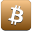
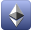

|Gradient|Normal|
|-------|-----|
|| |
|| | 
|| | 
|| |
|| | 
|| | 
|<h2>483 Crypto Icons</h2>|

# Cryptocurrency Squared Icons

This project contains 483 crypto coins icons at all

## NOTICE !
- This project was originally created for a few coin icons but later expanded. There may be errors in usage with different coins. Please report any errors, and I will update it when I have free time.
## Contribution

- Feel free to contribute or fork

## RoadMap

- All coins at coinmarketcap will be added and repository will be updated as well.
- Will be created webfont and css as well.
- Npm access will be added

## Licence

Released under [The MIT License](LICENCE)